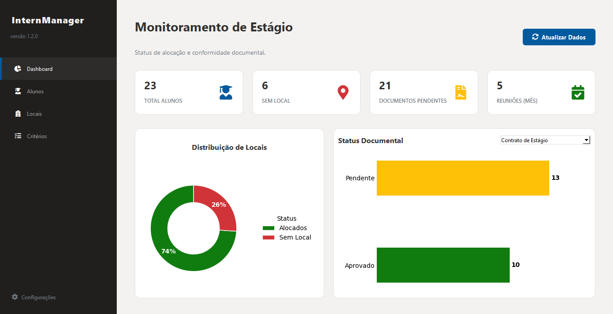

# Intern Manager Pro

---

**Sistema de gestão acadêmica focado no acompanhamento de estágios supervisionados.**

O **Intern Manager Pro** foi desenvolvido para solucionar a fragmentação de dados no acompanhamento de discentes. A aplicação centraliza cadastros, documentos obrigatórios e auditorias de campo, garantindo a integridade do histórico acadêmico desde a matrícula até a geração do relatório final.

{ align=center style="border: 1px solid #e1e4e8; border-radius: 6px; margin-top: 20px; margin-bottom: 20px; width: 100%" }

## Funcionalidades do Sistema

### 1. Gestão de Discentes
Módulo responsável pelo cadastro e manutenção dos dados dos estagiários.

* Controle de vigência de contratos.
* Associação com supervisores e locais de estágio (Venues).
* Histórico completo de alterações.

### 2. Módulo de Visitas Técnicas (Novo na v1.2.1)
Ferramenta de auditoria para supervisores de campo. Permite o registro detalhado das visitas realizadas in-loco.

* **Registro de Evidências:** Upload e armazenamento seguro de fotos das visitas.
* **Sanitização de Arquivos:** Renomeação automática de arquivos para padrão ISO.
* **Backup:** Ferramenta de exportação em lote para segurança dos dados.

### 3. Controle Documental
Monitoramento visual (Dashboard) do status de entrega de documentos obrigatórios.

* Termos de Compromisso.
* Fichas de Avaliação.
* Relatórios Parciais.

### 4. Geração de Relatórios
Compilação automatizada de todos os dados do semestre em um arquivo PDF padronizado, pronto para impressão e assinatura.

---

## Instalação e Execução

O sistema é distribuído como uma aplicação *standalone*, não necessitando de instalação de dependências externas (como Python ou servidores de banco de dados) na máquina do usuário final.

### Requisitos Mínimos
* **Windows:** 10 ou 11 (64-bits).
* **macOS:** Catalina (10.15) ou superior.
* **Espaço em Disco:** 200 MB livres.

### Procedimento
1. Acesse a [Página de Download](https://github.com/vonroderik/Intern-Manager/releases) no GitHub.
2.  Faça o download do arquivo compactado compatível com seu sistema operacional.
3.  Descompacte o arquivo e execute o binário `InternManager`.

> **Nota:** O banco de dados SQLite será criado automaticamente no diretório de dados do usuário na primeira execução.

---

## Stack Tecnológico

A aplicação foi construída utilizando tecnologias modernas e robustas para garantir performance e manutenibilidade a longo prazo.

| Componente | Tecnologia | Função |
| :--- | :--- | :--- |
| **Linguagem** | Python 3.12 | Core da aplicação. |
| **Interface** | PySide6 (Qt) | GUI nativa e responsiva. |
| **Database** | SQLite 3 | Armazenamento local e relacional. |
| **Relatórios** | ReportLab | Engine de geração de PDF. |
| **Análise** | Matplotlib | Renderização de gráficos e métricas. |

---

  <small>&copy; 2026 Rodrigo Noronha de Mello - Documentação Oficial</small>

