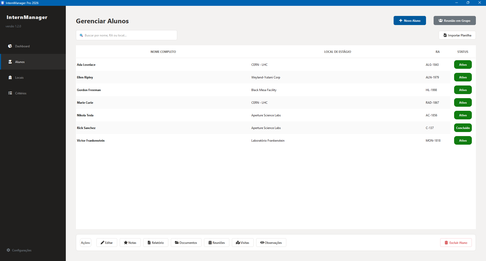
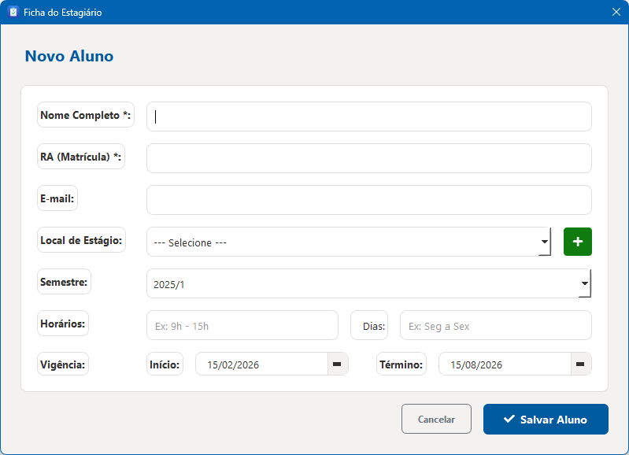
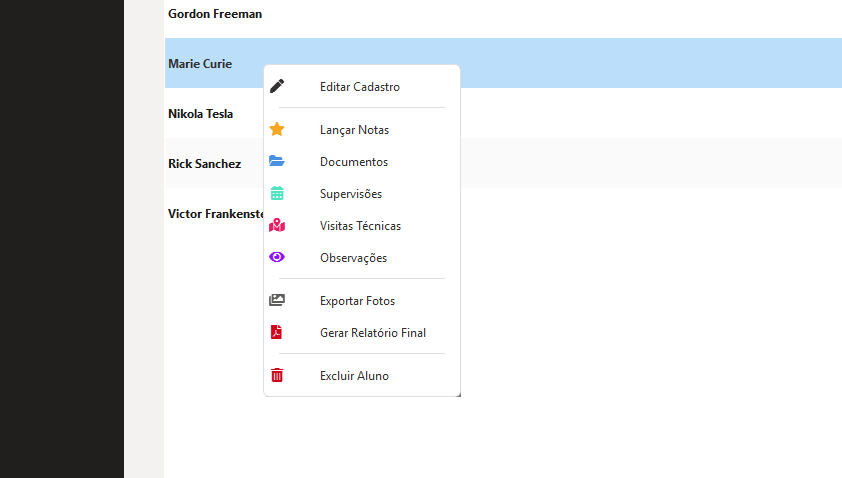

# Cadastro e Gestão de Discentes

O módulo de **Discentes** é o núcleo do sistema. Aqui você centraliza as informações contratuais e acadêmicas de cada estagiário.

{ align=center style="border: 1px solid #e1e4e8; border-radius: 6px; margin-bottom: 20px; width: 100%" }

## Fluxo de Cadastro

Para registrar um novo estagiário no sistema:

1. Clique no botão **Novo Aluno**.
2. Preencha os campos obrigatórios:
    * **Identificação:** Nome completo e número de matrícula.
    * **Vigência:** Datas de início e término (essencial para o cálculo de relatórios).
    * **Alocação:** Selecione o local de estágio (*Venue*).
3. Salve o registro.

{ align=center style="border: 1px solid #e1e4e8; border-radius: 6px; margin-bottom: 20px; width: 80%" }

## Operações via Menu de Contexto

O sistema utiliza um **Menu de Contexto Inteligente**. Ao clicar com o botão direito em um discente na tabela, você acessa rapidamente todos os módulos vinculados a ele:

* **Lançar Notas:** Registro de avaliações por critérios.
* **Documentos:** Gestão de status de termos e fichas.
* **Visitas Técnicas:** Histórico de supervisão de campo.

{ align=center style="border: 1px solid #e1e4e8; border-radius: 6px; margin-bottom: 20px; width: 50%" }

!!! info "Produtividade"
    Você pode selecionar múltiplos discentes (usando `Ctrl` ou `Shift`) para realizar exportações de fotos em lote.