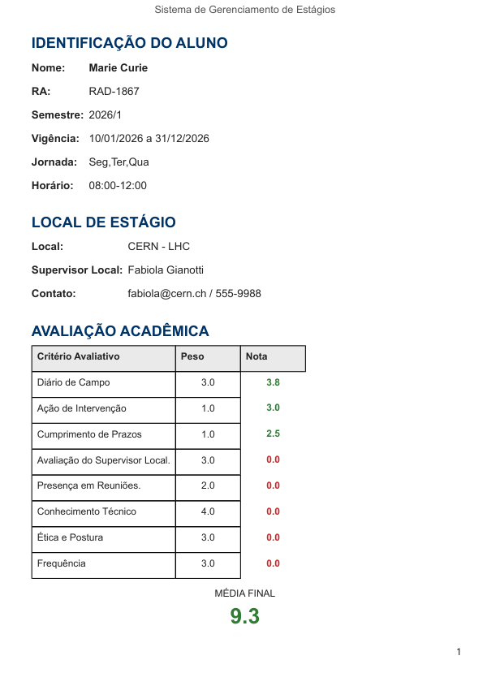

# Geração de Relatórios Automáticos

O **Intern Manager Pro** elimina a necessidade de preenchimento manual de formulários de conclusão de estágio, gerando documentos PDF padronizados e prontos para assinatura.

## Estrutura do Documento Final

O relatório consolidado inclui:
1. **Cabeçalho Institucional:** Dados do aluno e do local de estágio.
2. **Quadro de Avaliação:** Notas detalhadas por critério e média final.
3. **Log de Supervisão:** Tabela cronológica de todas as visitas técnicas e supervisões realizadas.
4. **Campo de Assinaturas:** Espaço dedicado para supervisor, preceptor e discente.

## Como Emitir o Relatório

1. Localize o discente na lista principal.
2. Clique com o **botão direito** e selecione **Gerar Relatório Final**.
3. O sistema processará os dados e abrirá o PDF automaticamente no seu visualizador padrão.

{ align=center style="border: 1px solid #e1e4e8; border-radius: 6px; margin-bottom: 20px; width: 80%" }

!!! tip "Dica de Auditoria"
    O relatório só exibe as visitas técnicas cadastradas no módulo de visitas. Certifique-se de que todos os registros de campo foram inseridos antes de emitir a versão final do documento.