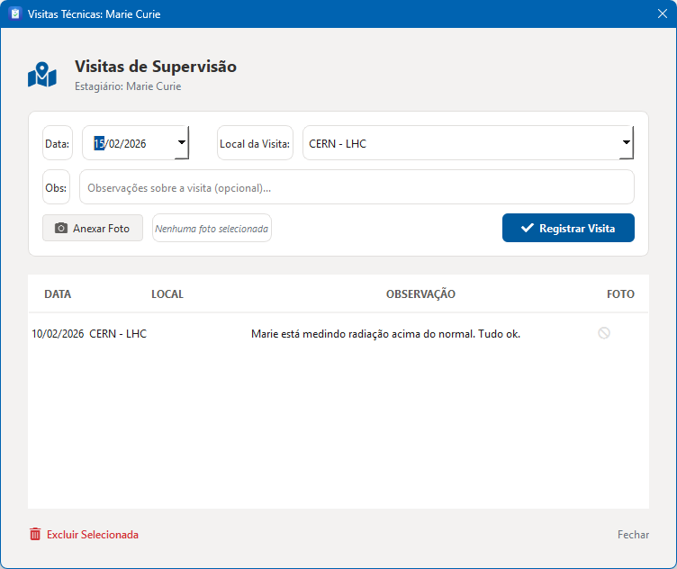
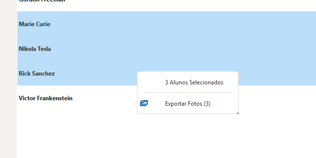

# Visitas Técnicas e Evidências

Este módulo permite o registro formal das supervisões diretas realizadas nos campos de estágio, garantindo o cumprimento das normas de fiscalização acadêmica.

## Registro de Campo

Ao realizar uma visita técnica:
1. Abra o diálogo de **Visitas Técnicas** através do menu de contexto do aluno.
2. Insira a data e as observações pertinentes ao desempenho do discente no local.
3. Utilize o campo de **Foto** para anexar uma evidência visual da visita.

{ align=center style="border: 1px solid #e1e4e8; border-radius: 6px; margin-bottom: 20px; width: 100%" }

### Gestão de Fotos
O sistema gerencia os arquivos de imagem de forma transparente:
* As fotos são copiadas para o diretório de dados da aplicação.
* Arquivos são renomeados para evitar conflitos.
* A exclusão de um registro de visita remove permanentemente o arquivo de imagem associado, mantendo o disco limpo.

## Exportação para Auditoria

Caso necessite enviar as evidências fotográficas para instâncias superiores:
1. Utilize a **Seleção Múltipla** na tabela principal para selecionar os alunos desejados.
2. Clique com o botão direito e selecione **Exportar Fotos**.
3. O sistema criará uma cópia organizada de todas as imagens na pasta de sua escolha.

{ align=center style="border: 1px solid #e1e4e8; border-radius: 6px; margin-bottom: 20px; width: 80%" }